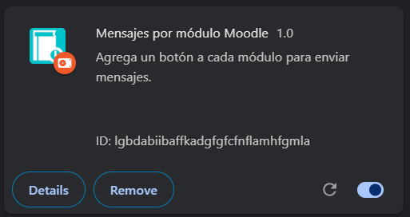
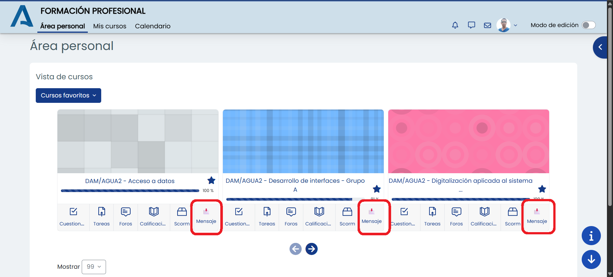

# Extensión para Chrome y Firefox que permite agregar un botón de acceso rápido a la mensajería de Moddle.

Este es un proyecto de código abierto que proporciona una extensión para navegadores web como Chrome y Firefox. Su objetivo es facilitar el acceso a la mensajería de Moddle, una plataforma de comunicación y colaboración.

## Características

- Acceso rápido a la mensajería de Moddle desde el navegador.
- Compatible con navegadores Chrome y Firefox.
- Interfaz de usuario intuitiva y fácil de usar.
- Código abierto y personalizable.

## Capturas de pantalla

## Instalación

### Chrome

1. Descarga el archivo ZIP del repositorio.
2. Descomprime el archivo ZIP.
3. Abre Chrome y ve a `chrome://extensions/`.
4. Activa el modo de desarrollador en la esquina superior derecha.
5. Haz clic en "Cargar descomprimida" y selecciona la carpeta descomprimida del proyecto.
6. La extensión debería aparecer en la lista de extensiones instaladas.
7. Haz clic en el icono de la extensión para abrir la mensajería de Moddle.

### Firefox

1. Descarga el archivo ZIP del repositorio.
2. Descomprime el archivo ZIP.
3. Abre Firefox y ve a `about:debugging#/runtime/this-firefox`.
4. Haz clic en "Cargar complemento temporal" y selecciona el archivo `manifest.json` de la carpeta descomprimida del proyecto.
5. La extensión debería aparecer en la lista de extensiones instaladas.
6. Haz clic en el icono de la extensión para abrir la mensajería de Moddle.

### Disponible para Firefox en [Addons-Mozilla.org](https://addons.mozilla.org/es-ES/firefox/addon/bot%C3%B3n-mensaje-moodle/)

## Licencia

Este proyecto está licenciado bajo GNU General Public License v3.0. Puedes ver el archivo [LICENSE](LICENSE) para más detalles.
